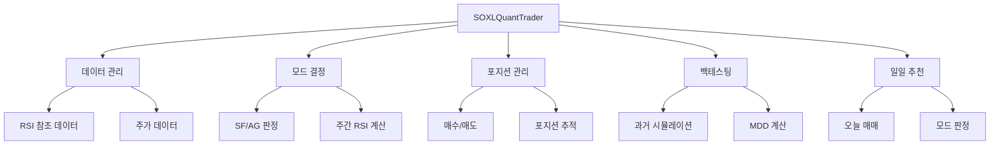
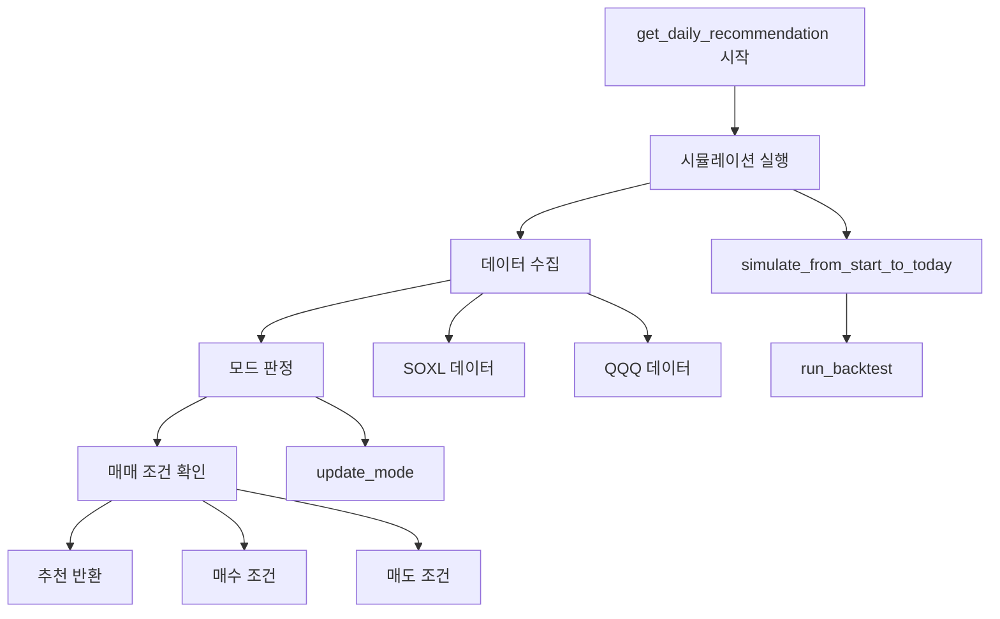
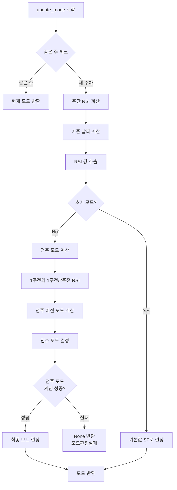
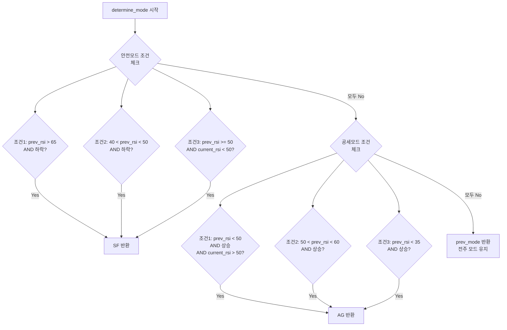
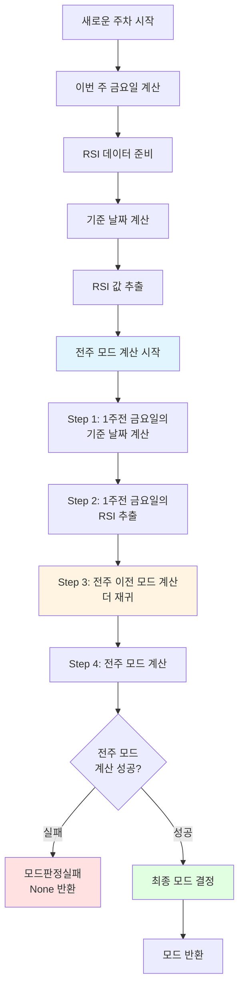
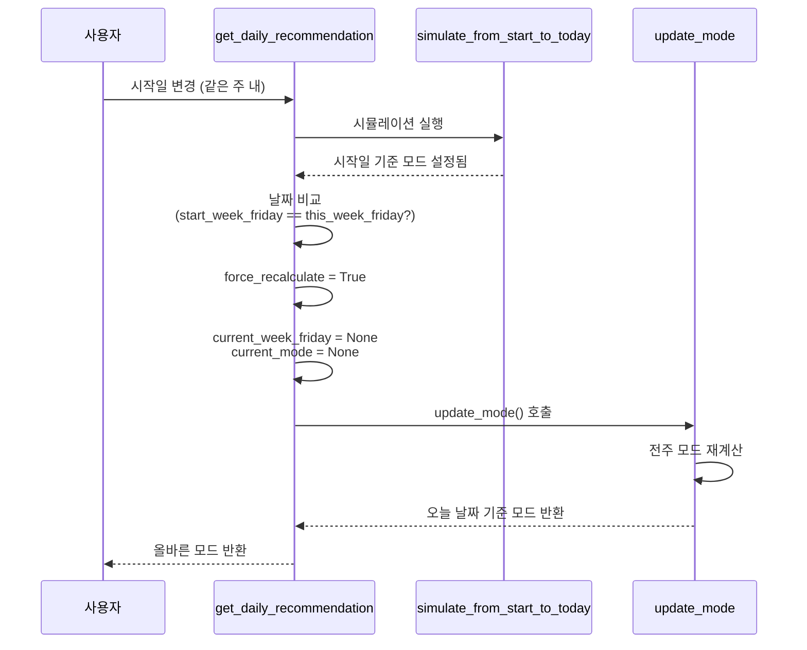

# SOXL 퀀트투자 시스템 알고리즘 도식화

## 📊 전체 시스템 구조



## 🔄 메인 플로우: 일일 매매 추천 생성



```
┌─────────────────────────────────────────────────────────────┐
│                    SOXLQuantTrader                          │
│                                                             │
│  ┌──────────────┐  ┌──────────────┐  ┌──────────────┐     │
│  │ 데이터 관리   │  │ 모드 결정    │  │ 포지션 관리  │     │
│  │              │  │              │  │              │     │
│  │ - RSI 참조   │  │ - SF/AG 판정 │  │ - 매수/매도  │     │
│  │ - 주가 데이터 │  │ - 주간 RSI   │  │ - 포지션 추적│     │
│  └──────────────┘  └──────────────┘  └──────────────┘     │
│                                                             │
│  ┌──────────────┐  ┌──────────────┐                       │
│  │ 백테스팅     │  │ 일일 추천     │                       │
│  │              │  │              │                       │
│  │ - 과거 시뮬  │  │ - 오늘 매매   │                       │
│  │ - MDD 계산   │  │ - 모드 판정   │                       │
│  └──────────────┘  └──────────────┘                       │
└─────────────────────────────────────────────────────────────┘
```

---

## 🔄 메인 플로우: 일일 매매 추천 생성

```
get_daily_recommendation()
│
├─ 1️⃣ 시뮬레이션 실행
│   └─ simulate_from_start_to_today()
│       └─ run_backtest() [시작일 → 오늘]
│           └─ 포지션 상태 업데이트
│
├─ 2️⃣ 데이터 수집
│   ├─ SOXL 데이터 가져오기 (get_stock_data)
│   └─ QQQ 데이터 가져오기 (주간 RSI 계산용)
│
├─ 3️⃣ 모드 판정 (핵심 로직)
│   └─ update_mode()
│       └─ [상세 흐름은 아래 참조]
│
├─ 4️⃣ 매매 조건 확인
│   ├─ 매수 조건 확인 (can_buy_next_round)
│   └─ 매도 조건 확인 (check_sell_conditions)
│
└─ 5️⃣ 추천 반환
    └─ Dict: {mode, buy_price, sell_price, ...}
```

---

## 🎯 모드 판정 알고리즘 (update_mode)



```
update_mode(qqq_data)
│
├─ 📅 오늘 날짜 기준 이번 주 금요일 계산
│   └─ this_week_friday = today + days_until_friday
│
├─ 🔍 같은 주 체크
│   └─ if current_week_friday == this_week_friday:
│       └─ return current_mode (변경 없음)
│
├─ 📊 주간 RSI 계산
│   ├─ QQQ 데이터 → 주간 데이터 변환 (W-FRI)
│   ├─ RSI 계산 (14주 Wilder's RSI)
│   └─ weekly_df, rsi 배열 생성
│
├─ 📅 기준 날짜 계산
│   ├─ latest_completed_friday (지난주 금요일)
│   ├─ one_week_ago_friday (1주전 금요일)
│   └─ two_weeks_ago_friday (2주전 금요일)
│
├─ 📈 RSI 값 추출
│   ├─ one_week_ago_rsi (1주전 RSI)
│   └─ two_weeks_ago_rsi (2주전 RSI)
│
├─ 🔄 전주 모드 계산 (재귀적)
│   │
│   ├─ 1주전 금요일의 1주전/2주전 RSI 찾기
│   │   ├─ prev_week_prev_friday (1주전의 1주전)
│   │   └─ prev_week_two_weeks_friday (1주전의 2주전)
│   │
│   ├─ 전주 이전 모드 계산 (더 재귀)
│   │   ├─ prev_prev_week_prev_friday
│   │   ├─ prev_prev_week_two_weeks_friday
│   │   └─ prev_prev_week_mode = determine_mode(...)
│   │
│   └─ actual_prev_week_mode = determine_mode(
│         prev_week_prev_rsi,
│         prev_week_two_weeks_rsi,
│         prev_prev_week_mode
│       )
│
├─ ❌ 전주 모드 계산 실패 체크
│   └─ if actual_prev_week_mode is None:
│       └─ return None (모드판정실패)
│
└─ ✅ 최종 모드 결정
    └─ new_mode = determine_mode(
          one_week_ago_rsi,      # 1주전 RSI
          two_weeks_ago_rsi,     # 2주전 RSI
          actual_prev_week_mode  # 전주 모드
        )
```

---

## 🧮 모드 결정 로직 (determine_mode)



```
determine_mode(current_rsi, prev_rsi, prev_mode)
│
├─ 📊 안전모드(SF) 조건 체크 (OR 조건)
│   ├─ 조건 1: prev_rsi > 65 AND prev_rsi > current_rsi
│   │   └─ RSI > 65 영역에서 하락
│   │
│   ├─ 조건 2: 40 < prev_rsi < 50 AND prev_rsi > current_rsi
│   │   └─ 40~50 구간에서 하락
│   │
│   └─ 조건 3: prev_rsi >= 50 AND current_rsi < 50
│       └─ 50선 아래로 하락
│
├─ 📊 공세모드(AG) 조건 체크 (OR 조건)
│   ├─ 조건 1: prev_rsi < 50 AND prev_rsi < current_rsi AND current_rsi > 50
│   │   └─ 50선 위로 상승
│   │
│   ├─ 조건 2: 50 < prev_rsi < 60 AND prev_rsi < current_rsi
│   │   └─ 50~60 구간에서 상승
│   │
│   └─ 조건 3: prev_rsi < 35 AND prev_rsi < current_rsi
│       └─ RSI < 35 영역에서 상승
│
└─ 🎯 결과 반환
    ├─ if 안전모드 조건 충족 → return "SF"
    ├─ if 공세모드 조건 충족 → return "AG"
    └─ else → return prev_mode (전주 모드 유지)
```

---

## 💰 백테스팅 알고리즘 (run_backtest)

```
run_backtest(start_date, end_date)
│
├─ 1️⃣ 초기화
│   ├─ 포트폴리오 리셋 (reset_portfolio)
│   ├─ RSI 참조 데이터 로드
│   └─ 시작 상태 확인 (check_backtest_starting_state)
│
├─ 2️⃣ 데이터 준비
│   ├─ SOXL 데이터 가져오기
│   ├─ QQQ 데이터 가져오기
│   └─ 백테스팅 기간 필터링
│
├─ 3️⃣ 일별 반복 처리
│   │
│   └─ for each day in backtest_period:
│       │
│       ├─ 📅 주차 변경 체크
│       │   └─ if 새로운 주차:
│       │       ├─ 주차별 RSI 가져오기
│       │       ├─ 모드 업데이트 (update_mode)
│       │       └─ week_modes 딕셔너리에 저장
│       │
│       ├─ 💰 시드증액 처리
│       │   └─ if 시드증액 날짜:
│       │       └─ 투자원금 업데이트
│       │
│       ├─ 🔴 매도 조건 확인
│       │   ├─ 목표가 도달 체크
│       │   └─ 손절예정일 경과 체크
│       │
│       ├─ 🟢 매수 조건 확인
│       │   ├─ can_buy_next_round() 체크
│       │   ├─ 매수가 > 종가 체크
│       │   └─ execute_buy() 실행
│       │
│       └─ 📊 일별 기록 저장
│           └─ daily_records.append()
│
└─ 4️⃣ 결과 계산
    ├─ MDD 계산 (calculate_mdd)
    ├─ 최종 자산 계산
    └─ 요약 반환
```

---

## 📈 주차별 모드 계산 상세 흐름 (재귀적)



```
새로운 주차 시작
│
├─ 📅 이번 주 금요일 계산
│   └─ this_week_friday = today + days_until_friday
│
├─ 📊 RSI 데이터 준비
│   ├─ QQQ 주간 데이터 변환
│   └─ RSI 배열 계산
│
├─ 🔍 기준 날짜 계산
│   ├─ latest_completed_friday (지난주 금요일)
│   ├─ one_week_ago_friday = latest_completed_friday
│   └─ two_weeks_ago_friday = latest_completed_friday - 7일
│
├─ 📈 RSI 값 추출
│   ├─ one_week_ago_rsi ← weekly_df에서 찾기
│   └─ two_weeks_ago_rsi ← weekly_df에서 찾기
│
├─ 🔄 전주 모드 계산 (재귀)
│   │
│   ├─ Step 1: 1주전 금요일의 기준 날짜 계산
│   │   ├─ prev_week_prev_friday = one_week_ago_friday - 7일
│   │   └─ prev_week_two_weeks_friday = one_week_ago_friday - 14일
│   │
│   ├─ Step 2: 1주전 금요일의 RSI 추출
│   │   ├─ prev_week_prev_rsi ← weekly_df에서 찾기
│   │   └─ prev_week_two_weeks_rsi ← weekly_df에서 찾기
│   │
│   ├─ Step 3: 전주 이전 모드 계산 (더 재귀)
│   │   ├─ prev_prev_week_prev_friday = prev_week_prev_friday - 7일
│   │   ├─ prev_prev_week_two_weeks_friday = prev_week_prev_friday - 14일
│   │   ├─ prev_prev_week_prev_rsi ← weekly_df에서 찾기
│   │   ├─ prev_prev_week_two_weeks_rsi ← weekly_df에서 찾기
│   │   └─ prev_prev_week_mode = determine_mode(
│   │         prev_prev_week_prev_rsi,
│   │         prev_prev_week_two_weeks_rsi,
│   │         "SF"  # 기본값
│   │       )
│   │
│   └─ Step 4: 전주 모드 계산
│       └─ actual_prev_week_mode = determine_mode(
│             prev_week_prev_rsi,
│             prev_week_two_weeks_rsi,
│             prev_prev_week_mode
│           )
│
├─ ❌ 실패 체크
│   └─ if actual_prev_week_mode is None:
│       └─ return None (모드판정실패)
│
└─ ✅ 최종 모드 결정
    └─ new_mode = determine_mode(
          one_week_ago_rsi,      # 1주전 RSI
          two_weeks_ago_rsi,     # 2주전 RSI
          actual_prev_week_mode   # 전주 모드
        )
```

---

## 🔄 같은 주 내 시작일 변경 시 처리 흐름



```
get_daily_recommendation()
│
├─ simulate_from_start_to_today() 실행
│   └─ 시작일 기준으로 모드 설정됨
│
├─ 📅 날짜 비교
│   ├─ this_week_friday_calc (오늘 기준 이번 주 금요일)
│   └─ start_week_friday (시작일 기준 이번 주 금요일)
│
├─ 🔍 같은 주 체크
│   └─ if start_week_friday == this_week_friday_calc:
│       └─ force_recalculate = True
│
├─ 🔄 강제 재계산
│   ├─ self.current_week_friday = None
│   ├─ self.current_mode = None
│   └─ update_mode() 호출
│       └─ 전주 모드를 올바르게 재계산
│
└─ ✅ 오늘 날짜 기준 모드 반환
```

---

## 📊 데이터 흐름도

```
┌─────────────┐
│ Yahoo Finance│
│     API     │
└──────┬──────┘
       │
       ├─ SOXL 데이터 ──┐
       │                │
       └─ QQQ 데이터 ───┼──→ get_stock_data()
                        │         │
                        │         ├─ 캐시 체크
                        │         └─ DataFrame 반환
                        │
                        ├─→ calculate_weekly_rsi()
                        │         │
                        │         └─ RSI 배열
                        │
                        └─→ update_mode()
                                  │
                                  └─ 모드 결정 (SF/AG)
```

---

## 💼 포지션 관리 흐름

```
매수 실행 (execute_buy)
│
├─ 회차별 매수 금액 계산
│   └─ calculate_position_size(round_num)
│
├─ 목표 수량 계산
│   └─ target_shares = target_amount / target_price
│
├─ 실제 매수 실행
│   ├─ actual_shares = 실제 매수 수량
│   ├─ actual_amount = actual_shares × actual_price
│   └─ 포지션 추가 (mode 저장)
│
└─ 포지션 정보 저장
    └─ {
        "round": 회차,
        "buy_date": 매수일,
        "buy_price": 매수가,
        "shares": 수량,
        "mode": 모드 (SF/AG)
      }

매도 실행 (execute_sell)
│
├─ 매도 조건 확인 (check_sell_conditions)
│   ├─ 목표가 도달 체크
│   └─ 손절예정일 경과 체크
│
├─ 매도 실행
│   ├─ proceeds = shares × sell_price
│   ├─ profit = proceeds - amount
│   └─ 포지션 제거
│
└─ 예수금 증가
    └─ available_cash += proceeds
```

---

## 🎯 핵심 포인트

### 1. 모드 판정의 재귀적 특성
- 전주 모드를 알기 위해 전전주 모드가 필요
- 전전주 모드를 알기 위해 전전전주 모드가 필요
- 최대한 과거로 거슬러 올라가며 모드 계산

### 2. 같은 주 체크
- 같은 주 내에서는 모드 변경 없음
- 주간 RSI는 금요일 기준으로 고정

### 3. 시작일과 오늘 날짜의 분리
- 시작일: 백테스팅 시작점
- 오늘 날짜: 실제 모드 판정 기준
- 같은 주 내에서 시작일 변경 시 강제 재계산

### 4. 모드 판정 실패 처리
- 전주 모드를 계산할 수 없으면 None 반환
- 기본값 사용하지 않음
- 명확한 실패 사유 출력

---

## 📝 주요 변수 설명

| 변수명 | 설명 |
|--------|------|
| `current_mode` | 현재 모드 (SF 또는 AG) |
| `current_week_friday` | 현재 주차의 금요일 날짜 |
| `one_week_ago_rsi` | 1주전 RSI (지난주 금요일 기준) |
| `two_weeks_ago_rsi` | 2주전 RSI (지지난주 금요일 기준) |
| `actual_prev_week_mode` | 전주 모드 (재귀적으로 계산) |
| `force_recalculate` | 강제 재계산 플래그 (같은 주 내 시작일 변경 시) |

