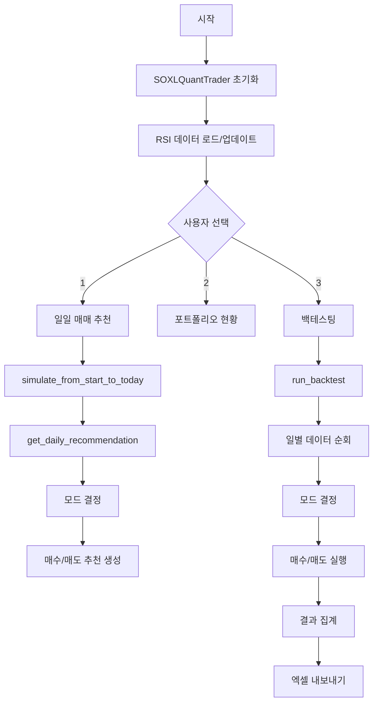
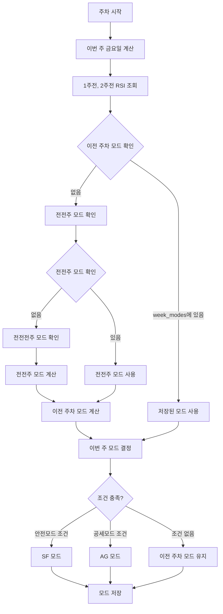
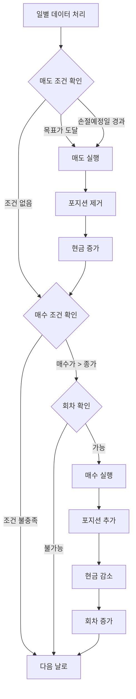

# SOXL 퀀트투자 시스템 코드 구조

## 📋 목차
1. [전체 구조 개요](#전체-구조-개요)
2. [클래스 구조](#클래스-구조)
3. [주요 메서드 분류](#주요-메서드-분류)
4. [데이터 흐름도](#데이터-흐름도)
5. [핵심 로직 흐름](#핵심-로직-흐름)

---

## 전체 구조 개요

```
soxl_quant_system.py
│
├── 📦 SOXLQuantTrader 클래스 (메인 클래스)
│   │
│   ├── 🔧 초기화 및 설정
│   ├── 📊 데이터 관리 (RSI, 주가 데이터)
│   ├── 🎯 모드 결정 (SF/AG)
│   ├── 💰 포지션 관리 (매수/매도)
│   ├── 📈 백테스팅
│   └── 📄 결과 출력 (엑셀, 콘솔)
│
└── 🚀 main() 함수 (CLI 인터페이스)
```

---

## 클래스 구조

### SOXLQuantTrader 클래스

```python
class SOXLQuantTrader:
    """SOXL 퀀트투자 시스템"""
    
    # ========== 초기화 ==========
    __init__(initial_capital, sf_config, ag_config)
    
    # ========== 데이터 관리 ==========
    _resolve_data_path(filename)
    load_rsi_reference_data(filename)
    get_rsi_from_reference(date, rsi_data)
    check_and_update_rsi_data(filename)
    update_rsi_reference_file(filename)
    get_stock_data(symbol, period)
    get_intraday_last_price(symbol)
    calculate_weekly_rsi(df, window)
    
    # ========== 모드 결정 ==========
    determine_mode(current_rsi, prev_rsi, prev_mode)
    update_mode(qqq_data)
    get_current_config()
    
    # ========== 포지션 관리 ==========
    calculate_buy_sell_prices(current_price)
    calculate_position_size(round_num)
    calculate_stop_loss_date(buy_date, max_hold_days)
    is_trading_day(date)
    can_buy_next_round()
    execute_buy(target_price, actual_price, current_date, mode)
    execute_sell(sell_info)
    check_sell_conditions(row, current_date, prev_close)
    reconcile_positions_with_close_history(soxl_data)
    update_position(position_index, new_shares, new_buy_price)
    
    # ========== 백테스팅 ==========
    simulate_from_start_to_today(start_date, quiet)
    check_backtest_starting_state(start_date, rsi_ref_data)
    run_backtest(start_date, end_date)
    calculate_mdd(daily_records)
    export_backtest_to_excel(backtest_result, filename)
    
    # ========== 일일 추천 ==========
    get_daily_recommendation()
    print_recommendation(rec)
    
    # ========== 유틸리티 ==========
    is_market_closed(date)
    is_regular_session_closed_now()
    get_latest_trading_day()
    get_today_date()
    set_test_today(date_str)
    reset_portfolio()
    clear_cache()
    add_seed_increase(date, amount, description)
    get_seed_increases_for_date(date)
    get_week_number(date)
```

---

## 주요 메서드 분류

### 1. 데이터 관리 (Data Management)

| 메서드 | 설명 | 반환값 |
|--------|------|--------|
| `load_rsi_reference_data()` | RSI 참조 데이터 로드 (JSON) | dict |
| `get_rsi_from_reference()` | 특정 날짜의 RSI 값 조회 | float |
| `get_stock_data()` | Yahoo Finance에서 주가 데이터 가져오기 | DataFrame |
| `calculate_weekly_rsi()` | 주간 RSI 계산 (14주 Wilder's RSI) | float |
| `check_and_update_rsi_data()` | RSI 데이터 최신 여부 확인 | bool |
| `update_rsi_reference_file()` | RSI 참조 파일 업데이트 | bool |

### 2. 모드 결정 (Mode Determination)

| 메서드 | 설명 | 반환값 |
|--------|------|--------|
| `determine_mode()` | RSI 기반 모드 결정 (SF/AG) | str |
| `update_mode()` | QQQ 주간 RSI 기반 모드 업데이트 | str |
| `get_current_config()` | 현재 모드에 따른 설정 반환 | dict |

**모드 결정 로직:**
```
안전모드(SF) 조건:
  - RSI > 65 영역에서 하락
  - 40 < RSI < 50에서 하락
  - RSI가 50 밑으로 하락

공세모드(AG) 조건:
  - RSI가 50 위로 상승
  - 50 < RSI < 60에서 상승
  - RSI < 35 영역에서 상승

조건 충족 없음 → 이전 주차 모드 유지
```

### 3. 포지션 관리 (Position Management)

| 메서드 | 설명 | 반환값 |
|--------|------|--------|
| `execute_buy()` | 매수 실행 (LOC 주문) | bool |
| `execute_sell()` | 매도 실행 | tuple |
| `check_sell_conditions()` | 매도 조건 확인 | List[Dict] |
| `calculate_buy_sell_prices()` | 매수/매도 가격 계산 | Tuple[float, float] |
| `calculate_position_size()` | 회차별 매수 금액 계산 | float |
| `reconcile_positions_with_close_history()` | 과거 종가 기반 포지션 보정 | None |

**매수/매도 로직:**
```
매수 조건:
  - LOC 매수: 매수가 > 종가
  - 회차별 분할매수 (SF: 7회, AG: 8회)
  - 예수금 확인

매도 조건:
  1. 목표가 도달 (종가 >= 매도목표가)
  2. 손절예정일 경과 (최대 보유기간 초과)
```

### 4. 백테스팅 (Backtesting)

| 메서드 | 설명 | 반환값 |
|--------|------|--------|
| `run_backtest()` | 백테스팅 실행 (메인) | Dict |
| `simulate_from_start_to_today()` | 시작일부터 오늘까지 시뮬레이션 | Dict |
| `check_backtest_starting_state()` | 백테스팅 시작 상태 확인 | dict |
| `calculate_mdd()` | 최대 낙폭(MDD) 계산 | Dict |
| `export_backtest_to_excel()` | 결과를 엑셀 파일로 내보내기 | str |

**백테스팅 흐름:**
```
1. 시작 상태 확인 (모드, 회차, RSI)
2. 일별 데이터 순회
   - 주차별 모드 결정
   - 매도 조건 확인 및 실행
   - 매수 조건 확인 및 실행
3. 결과 집계 및 MDD 계산
4. 엑셀 파일로 내보내기
```

### 5. 일일 추천 (Daily Recommendation)

| 메서드 | 설명 | 반환값 |
|--------|------|--------|
| `get_daily_recommendation()` | 일일 매매 추천 생성 | Dict |
| `print_recommendation()` | 매매 추천 출력 | None |

---

## 데이터 흐름도

### 전체 시스템 흐름



### 모드 결정 흐름



### 매수/매도 실행 흐름



---

## 핵심 로직 흐름

### 1. 백테스팅 실행 (`run_backtest`)

```
1. 초기화
   ├── 포트폴리오 리셋
   ├── RSI 데이터 로드
   └── 시작 상태 확인 (모드, 회차)

2. 일별 데이터 순회
   ├── 주차 확인 (금요일 기준)
   │   ├── 새로운 주차면 모드 결정
   │   └── week_modes에 저장
   │
   ├── 매도 조건 확인
   │   ├── 목표가 도달?
   │   └── 손절예정일 경과?
   │
   └── 매수 조건 확인
       ├── 매수가 > 종가?
       ├── 회차 가능?
       └── 예수금 충분?

3. 결과 집계
   ├── 최종 자산 계산
   ├── MDD 계산
   └── 엑셀 내보내기
```

### 2. 일일 추천 생성 (`get_daily_recommendation`)

```
1. 상태 업데이트
   └── simulate_from_start_to_today()

2. 데이터 수집
   ├── SOXL 데이터 (최근 1개월)
   └── QQQ 데이터 (최근 6개월)

3. 모드 결정
   ├── 1주전, 2주전 RSI 계산
   └── determine_mode() 호출

4. 매수/매도 추천 생성
   ├── 매수 조건 확인
   ├── 매도 조건 확인
   └── 포트폴리오 현황 계산

5. 결과 반환
   └── Dict 형태로 반환
```

### 3. 모드 결정 상세 로직 (`determine_mode`)

```
입력: current_rsi (1주전), prev_rsi (2주전), prev_mode (이전 주차 모드)

1. 안전모드 조건 확인
   ├── prev_rsi > 65 AND prev_rsi > current_rsi
   ├── 40 < prev_rsi < 50 AND prev_rsi > current_rsi
   └── prev_rsi >= 50 AND current_rsi < 50
   
   → 하나라도 충족하면 "SF" 반환

2. 공세모드 조건 확인
   ├── prev_rsi < 50 AND prev_rsi < current_rsi AND current_rsi > 50
   ├── 50 < prev_rsi < 60 AND prev_rsi < current_rsi
   └── prev_rsi < 35 AND prev_rsi < current_rsi
   
   → 하나라도 충족하면 "AG" 반환

3. 조건 충족 없음
   └── prev_mode 반환 (이전 주차 모드 유지)
```

---

## 주요 인스턴스 변수

### 포지션 관리
- `positions`: 보유 포지션 리스트
- `current_round`: 현재 매수 회차
- `available_cash`: 예수금
- `initial_capital`: 초기 투자금
- `current_investment_capital`: 현재 투자원금

### 모드 관리
- `current_mode`: 현재 모드 (SF/AG)
- `current_week_friday`: 현재 주차의 금요일
- `sf_config`: 안전모드 설정
- `ag_config`: 공세모드 설정

### 데이터 캐시
- `_stock_data_cache`: 주가 데이터 캐시
- `_simulation_cache`: 시뮬레이션 결과 캐시

### 시드증액 관리
- `seed_increases`: 시드증액 목록
- `processed_seed_dates`: 처리된 시드증액 날짜

---

## 설정 파라미터

### 안전모드 (SF) 기본값
```python
{
    "buy_threshold": 3.5,      # 매수가: 전일 종가 +3.5%
    "sell_threshold": 1.4,     # 매도가: 전일 종가 +1.4%
    "max_hold_days": 35,       # 최대 보유기간: 35거래일
    "split_count": 7,          # 분할매수 횟수: 7회
    "split_ratios": [0.049, 0.127, 0.230, 0.257, 0.028, 0.169, 0.140]
}
```

### 공세모드 (AG) 기본값
```python
{
    "buy_threshold": 3.6,      # 매수가: 전일 종가 +3.6%
    "sell_threshold": 3.5,     # 매도가: 전일 종가 +3.5%
    "max_hold_days": 7,        # 최대 보유기간: 7거래일
    "split_count": 8,          # 분할매수 횟수: 8회
    "split_ratios": [0.062, 0.134, 0.118, 0.148, 0.150, 0.182, 0.186, 0.020]
}
```

---

## 파일 구조

```
soxl_quant_system.py (3,447줄)
│
├── 📦 Import 섹션 (1-14줄)
│   └── requests, json, datetime, pandas, numpy 등
│
├── 📦 SOXLQuantTrader 클래스 (17-3276줄)
│   │
│   ├── 🔧 초기화 및 설정 (374-483줄)
│   ├── 📊 데이터 관리 (21-372줄)
│   ├── 🎯 모드 결정 (983-1165줄)
│   ├── 💰 포지션 관리 (1167-1600줄)
│   ├── 📈 백테스팅 (1602-2915줄)
│   └── 📄 유틸리티 (2917-3276줄)
│
└── 🚀 main() 함수 (3278-3445줄)
    └── CLI 인터페이스
```

---

## 주요 데이터 구조

### Position (포지션)
```python
{
    "round": 1,                    # 회차
    "buy_date": datetime,          # 매수일
    "buy_price": float,            # 매수가
    "shares": int,                 # 수량
    "amount": float,               # 투자금액
    "target_price": float,         # 목표가 (참조용)
    "mode": "SF" or "AG"           # 매수 시점의 모드
}
```

### Daily Record (일별 기록)
```python
{
    "date": "2025-12-31",
    "week": 1,
    "rsi": 59.14,
    "mode": "SF",
    "current_round": 1,
    "buy_executed_price": 0.0,
    "buy_quantity": 0,
    "sell_date": "",
    "realized_pnl": 0.0,
    "total_assets": 40000.0,
    ...
}
```

### Recommendation (일일 추천)
```python
{
    "date": "2025-12-31",
    "mode": "SF",
    "qqq_one_week_ago_rsi": 59.14,
    "qqq_two_weeks_ago_rsi": 59.14,
    "soxl_current_price": 43.67,
    "buy_price": 45.20,
    "sell_price": 44.28,
    "can_buy": True,
    "next_buy_round": 1,
    "sell_recommendations": [],
    "portfolio": {...}
}
```

---

## 핵심 알고리즘

### 1. 주차별 모드 결정 알고리즘

```
목표: 이번 주의 모드를 정확히 결정

1. 이번 주 금요일 계산
2. 1주전, 2주전 RSI 조회
3. 이전 주차 모드 확인
   - week_modes 딕셔너리에서 확인
   - 없으면 역순으로 계산 (전전주 → 전전전주)
4. determine_mode() 호출
   - 안전모드 조건 확인
   - 공세모드 조건 확인
   - 조건 없으면 이전 주차 모드 유지
5. week_modes에 저장
```

### 2. 매수 실행 알고리즘

```
목표: LOC 매수 주문 실행

1. 회차 확인 (can_buy_next_round)
2. 매수 금액 계산 (calculate_position_size)
3. 목표가 기준 수량 계산
4. 실제 가격으로 매수
5. 예수금 부족 시 재계산
6. 포지션 추가 (모드 저장)
```

### 3. 매도 실행 알고리즘

```
목표: LOC 매도 주문 실행

1. 보유 포지션 순회
2. 매도 조건 확인
   - 목표가 도달? (종가 >= 매도목표가)
   - 손절예정일 경과?
3. 매도 실행
4. 포지션 제거
5. 현금 증가
6. 회차 재계산
```

---

## 주요 개선 사항 (최근 수정)

### 모드 일관성 보장
- `week_modes` 딕셔너리로 주차별 모드 저장
- 이전 주차 모드를 역순으로 정확히 계산
- 같은 주 내에서는 모드 변경 방지

### 포지션 모드 저장
- 매수 시점의 모드를 포지션에 저장
- 시뮬레이션 후에도 모드 보존
- 백업/복원 로직 추가

### 12/29~1/2 주차 특별 검증
- 이전 주차가 안전모드면 강제로 안전모드 유지
- 디버깅 로그 추가

---

## 사용 예시

### 백테스팅 실행
```python
trader = SOXLQuantTrader(initial_capital=40000)
result = trader.run_backtest("2025-08-27", "2025-12-30")
trader.export_backtest_to_excel(result)
```

### 일일 추천 조회
```python
trader = SOXLQuantTrader(initial_capital=40000)
trader.session_start_date = "2025-08-27"
trader.simulate_from_start_to_today("2025-08-27")
recommendation = trader.get_daily_recommendation()
trader.print_recommendation(recommendation)
```

---

## 참고사항

- **RSI 계산**: 14주 Wilder's RSI 사용
- **데이터 소스**: Yahoo Finance API
- **캐싱**: 주가 데이터 1분 캐시, 시뮬레이션 30초 캐시
- **시장 시간**: 미국 동부시간(ET) 기준
- **휴장일**: 미국 증시 휴장일 자동 처리

---

**작성일**: 2025-12-31  
**버전**: 최신 (모드 일관성 보장 개선 버전)

